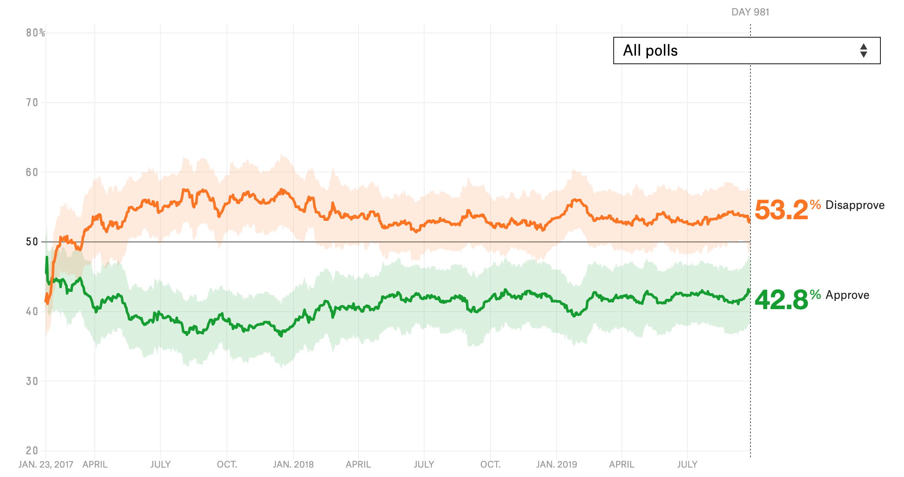

```{r setup, include=FALSE}
knitr::opts_chunk$set(echo = TRUE, message = FALSE)
```

### Original Figure
For this exercise, I tried to recreate a graph of how Trump's approval ratings have changed over time. The figure and associated description can be found [here](https://projects.fivethirtyeight.com/trump-approval-ratings/).

The figure is shown below. It's an interactive figure, and I couldn't figure out how to download it as a static figure so I just saved a screenshot.



### Original Data
I downloaded the data from the [FiveThirtyEight data page](https://data.fivethirtyeight.com/) and saved it to the working directory

### Load R Packages
```{r load_packages}
library(tidyverse)
library(magrittr)
library(stringr)
library(ggthemes)
library(scales)
```

#### Import and check the data

```{r import_data}
dat <- read_csv("approval_topline.csv")
glimpse(dat)
```

Based on my glimpse of the data, here are the things I will I want to do next:

* Check ranges of values in each category, to see if there's anything funny. 
* For the variables 'president' and 'subgroup', check the levels in each variable
* I think 'modeldate' is the x-axis in the figure. I'll have to look at the data to confirm
* I'll want to tidy the data. I could probably just use a different geom_line for 'approve_estimate' and for 'disapprove_estimate', but just for practice I'll create a new column called 'dxn' with the values 'approve' or 'disapprove'. I will then be able to use the color aesthetic by 'dxn')

```{r format_data}
dat$modeldate <- as.Date(dat$modeldate, "%m/%d/%Y") # convert to date format
range(dat$modeldate) # dates range from Jan 23, 2017 to Sept. 27, 2019. That matches what the figure shows.

unique(dat$president) # only Donald Trump, so I don't need this variable
levels(dat$subgroup <- factor(dat$subgroup)) # convert to factor and check the levels. There are three subgroups--I'll use the RMarkdown parameter function (see YAML) to let the user choose the subgroup that will be summarized in the figure

summary(subset(dat, select = approve_estimate:disapprove_lo)) # check the range of values for each numeric factor. These look reasonable

# Rearrange the data
dat2 <- dat %>%
  dplyr::select(-president, -timestamp) %>% # don't need these two columns
  gather(key = "temp", value = "rating", -subgroup, -modeldate)
dat2[, c("dxn", "estim_type")] <- str_split(dat2$temp, pattern = "_", simplify = TRUE)
dat2$temp <- NULL # remove this variable
dat3 <- dat2 %>%
  spread(key = estim_type, value = rating) # now I'm spreading out the estimates into 3 columns (estimate, hi, lo) so I can create the confidence bands with geom_ribbon. This probably isn't the most efficient way to get the data in this format, but it's a way I can understand in my head
dat3$dxn <- factor(dat3$dxn)

# Check the final data
glimpse(dat3) # looks good, I think
```

### Make the Figure
```{r fig_crack1}
ggplot(dat3, aes(x = modeldate, y = estimate, color = dxn)) +
  geom_line() + 
  geom_ribbon(aes(ymin = lo, ymax = hi), alpha = 0.3) +
  theme_fivethirtyeight()
```
 
WELL, that is not what I was trying for. I'll start off by making these changes:

* y-axis should go to 80 and should have

* background should be white

* ribbon fill should be based on 'dxn'

* remove axis titles

* add a horizontal line at yintercept = 50

* x-axis labels are month-year, sort of.... I'm not sure actually how to do some with month-year and others with just month

* add a vertical dotted line at the current date and label it with 'DAY ...'

* legend should be on right side and should show the current number

* colors should be changed

* and I totally forgot, I only want to plot the user-selected subgroup

I'm going to forget theme_fivethirtyeight. I think it will be easier for me to use theme_bw

```{r fig_crack2}
current_approve <- round(dat3$estimate[dat3$subgroup == params$poll_group & dat3$dxn == "approve" & dat3$modeldate == max(dat3$modeldate)], 1)
current_disapprove <- round(dat3$estimate[dat3$subgroup == params$poll_group & dat3$dxn == "disapprove" & dat3$modeldate == max(dat3$modeldate)], 1)

ggplot(subset(dat3, subgroup == params$poll_group), aes(x = modeldate, y = estimate)) +
  geom_line(aes(color = dxn), show.legend = FALSE) + # I've moved color into here because I know how to turn off the color legend from here
  ylim(0, 80) + # set y-axis limits
  geom_vline(xintercept = max(dat3$modeldate), linetype = "dotted") +
  geom_hline(yintercept = 50) +
  # geom_text(aes(x = max(dat3$modeldate), label= paste0("DAY ", max(dat3$modeldate) - (dat3$modeldate), y=20)), colour="gray") +
  scale_x_date(labels = date_format("%b-%y")) + # x-axis labels as month-year. Requires package 'scales'
  geom_ribbon(aes(ymin = lo, ymax = hi, fill = dxn), alpha = 0.3, color = NA, show.legend = FALSE) + # remove the color lines around ribbon and remove the legend
  geom_text(aes(x = max(dat3$modeldate)-100, label= paste0(current_disapprove, "% Disapprove"), y = current_disapprove+10), colour="darkorange3", size = 5) + # Disapproval legend - I couldn't figure out how to get the text OUTSIDE of the plot, so I put it inside the plot. I played around a lot to figure out the best numbers
  geom_text(aes(x = max(dat3$modeldate)-5, label= paste0("DAY ", max(dat3$modeldate) - min(dat3$modeldate)), y = 80), color = "gray", size = 3) + # label the current day (since beginning of polling)
  geom_text(aes(x = max(dat3$modeldate)-100, label= paste0(current_approve, "% Approve"), y = current_disapprove-25), colour="chartreuse4", size = 5) + 
  scale_color_manual(values = c("approve" = "chartreuse4", "disapprove" = "darkorange3")) +
  scale_fill_manual(
    values = c("approve" = "chartreuse4", "disapprove" = "darkorange3"),
    labels = c(as.character(current_approve), as.character(current_disapprove))) + # extract the current poll estimate 
  theme_bw() +
  theme(legend.position = "right", # move legend to right side of figure
        axis.title.x=element_blank(), # remove axis titles
        axis.title.y=element_blank())
```

Well SHOOT, I feel like I got close but couldn't figure out certain things, like: 

* how to get the 'subgroup' option (All polls, etc.) right on the graph instead of as part of the RMarkdown YAML

* what font was used in the real figure

* how to get the x-axis labels right

* how to get the current approve/disapprove "legends" outside of the plot and with different colored text

I'll have to do some more Googling to figure these things out, but it was a fun exercise to get to this point!